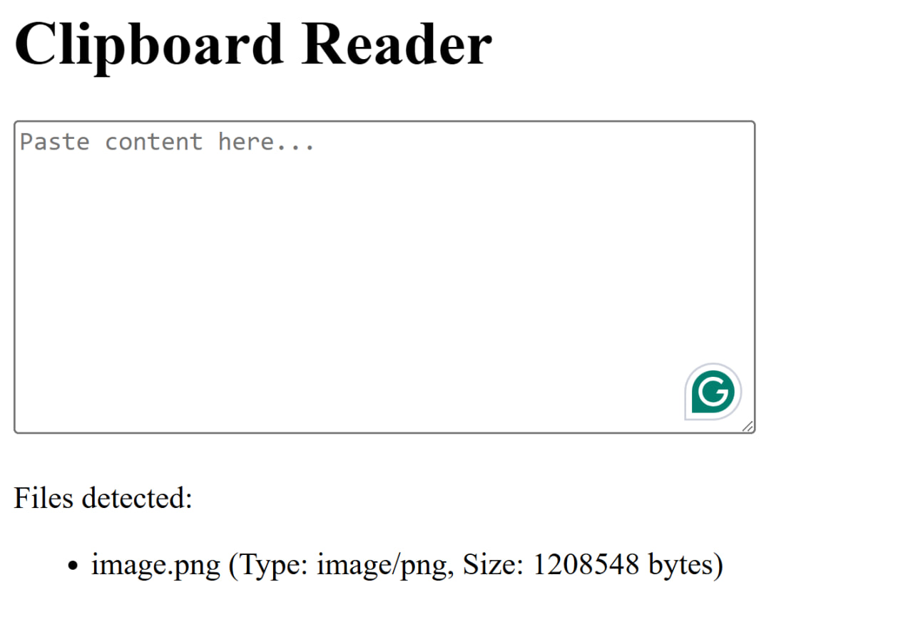

# ClipboardReaderJS

ClipboardReaderJS is a simple web-based tool that allows users to paste content from their clipboard, which is then analyzed to detect the type of data. The tool can detect plain text, HTML, files, images, and binary data. It can be integrated into any web application to analyze pasted data in real-time.

## Features

- Detects and displays plain text from the clipboard.
- Recognizes and displays HTML content.
- Handles files with metadata such as file name, type, and size.
- Detects and displays images, including base64-encoded image strings.
- Supports multiple image formats (e.g., JPG, PNG, GIF, SVG, TIFF, WebP, and more).
- Identifies binary data and displays it in a readable format.



## Installation

Clone or download the repository to your local machine:

```bash
git clone https://github.com/BaseMax/ClipboardReaderJS.git
cd ClipboardReaderJS
```

After downloading, open the `index.html` file in your browser to start using the `ClipboardReaderJS` tool.

## Usage

- Paste content into the textarea element.
- The content will be automatically analyzed, and the result will be displayed below the textarea.
- The tool can detect:
  - Plain text
  - HTML content
  - Image data (base64 or file URL)
  - Binary data
  - Files (with details like name, type, and size)

### License

MIT License

Copyright 2025, Max Base
